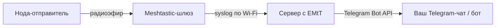

# Easy Meshtastic to Telegram

[![Версия][releases-shield]][releases]
[![Telegram][telegram-shield]][telegram]
[![Boosty][boosty-shield]][boosty]

**EMtT** — это простой и надёжный мост, который пересылает сообщения из радиосети Meshtastic прямо в Telegram. Никаких сложных настроек и никакого MQTT. Просто включите Wi-Fi на ноде и укажите адрес сервера.

Проект основан на коде [петербургского публичного моста](https://mansmarthome.info/posts/radio/kak-ia-sviazyval-meshtastic-i-telegram-istoriia-pietierburghskogho-mosta/), который работает с 2023 года. Теперь вы тоже можете развернуть свой собственный мост за несколько минут.

### Как это работает

Всё, что нужно от вашей Meshtastic-ноды — это возможность отправлять `syslog` через Wi-Fi. EMtT принимает эти сообщения, парсит их и пересылает в Telegram с помощью Bot API.



### Сценарии использования

1. «Семейный» — для связи с близкими там, где нет сотовой связи. Вы отправляете сообщение на свою вторую Meshtastic-ноду, а ваши близкие могут получить его как обычное сообщение в Telegram. Никаких лишних приложений.
2. Мониторинговый — чтобы читать местный эфирный чатик, не открывая приложение Meshtastic.

### Установка

Есть два способа получить EMtT — выбирайте наиболее подходящий.

#### Для подписчиков Boosty (готовые сборки)

Если вы не хотите разбираться с компиляцией и предпочитаете готовое решение, [поддержите проект на Boosty](https://boosty.to/mansmarthome/posts/ca2ddb88-d808-419b-8faf-5d5619f66b95). В благодарность за подписку вы получите доступ к:
* **Готовым Docker-образам** для архитектур `amd64` (серверы, ПК) и `aarch64` (Raspberry Pi, NAS).
* **Скомпилированным бинарникам** для Linux (`amd64`, `aarch64`).
* **Установщику для Windows** (GUI) для простой установки и настройки.
* **Подробной документации** по настройке и использованию.

#### Open Source (сборка из исходников)

Исходный код полностью открыт на GitHub. Всё, что вам понадобится — это Rust и Cargo.


**Инструкция по сборке:**

1. Клонируйте репозиторий:
   ```bash
   git clone https://github.com/black-roland/emtt.git
   cd emtt
   ```
2. Соберите проект в режиме release:
   ```bash
   cargo build --release
   ```
3. Готовый бинарный файл будет находиться в директории `target/release/emtt`. Вы можете скопировать его в удобное место, например, `/usr/local/bin`:
   ```bash
   sudo cp target/release/emtt /usr/local/bin/
   ```

### Быстрый запуск

После установки EMtT его нужно просто запустить, передав токен вашего Telegram-бота и ID чата, куда отправлять сообщения.

1. **Создайте Telegram-бота** через [@BotFather](https://t.me/BotFather) и получите его токен.
2. **Узнайте ID чата** (это может быть ID пользователя или группы). Можно использовать бота [@myidbot](https://t.me/myidbot).
3. Запустите EMtT:
   ```bash
   emtt syslog --chat-id=<ID_чата_или_пользователя> --bot-token=<токен_бота_в_Telegram>
   ```

   Демон запустится и начнет слушать UDP-порт `50514` на всех сетевых интерфейсах.

### Настройка Meshtastic-ноды (шлюза)

Теперь нужно настроить вашу Meshtastic-ноду, которая будет выступать в роли шлюза.

1. Подключитесь к ноде через приложение Meshtastic (iOS/Android) или через CLI.
2. Перейдите в настройки Wi-Fi и подключите ноду к вашей домашней сети (той же, где работает сервер с EMtT).
3. В настройках сети найдите поле **«Rsyslog server»** (или «Сервер syslog»).
4. Введите IP-адрес вашего сервера, на котором запущен EMtT, и порт `50514` в формате: `<IP-адрес>:50514`. Например, `192.168.1.100:50514`.

Готово! Теперь все личные сообщения, которые получит ваша нода-шлюз, будут дублироваться в Telegram-чат.

### Поддержка и обратная связь

* **Баг-репорты и предложения:** пожалуйста, создавайте [issues](https://github.com/black-roland/emtt/issues) на GitHub.
* **Готовые сборки и приоритетная поддержка:** доступны для подписчиков [Boosty](https://boosty.to/mansmarthome/posts/ca2ddb88-d808-419b-8faf-5d5619f66b95).
* **Вопросы и обсуждения:** присоединяйтесь к моему [Telegram-чату](https://t.me/+BBhPhVEURE1iZTZi).

### Товарные знаки

Meshtastic® is a registered trademark of Meshtastic LLC. Meshtastic software components are released under various licenses, see [GitHub](https://github.com/meshtastic) for details. No warranty is provided — use at your own risk.

This site is not affiliated with or endorsed by the Meshtastic project. The official website is [meshtastic.org](https://meshtastic.org/).

[releases-shield]: https://img.shields.io/badge/1.2.2-версия-blue?logo=github&style=flat-square&cacheSeconds=86400
[releases]: https://github.com/black-roland/emtt/blob/main/LICENSE
[telegram-shield]: https://img.shields.io/badge/Telegram-чат-blue?style=flat-square&logo=telegram
[telegram]: https://t.me/+BBhPhVEURE1iZTZi
[boosty-shield]: https://img.shields.io/badge/Boosty-готовые_сборки-orange?style=flat-square&logo=boosty
[boosty]: https://boosty.to/mansmarthome/posts/ca2ddb88-d808-419b-8faf-5d5619f66b95
